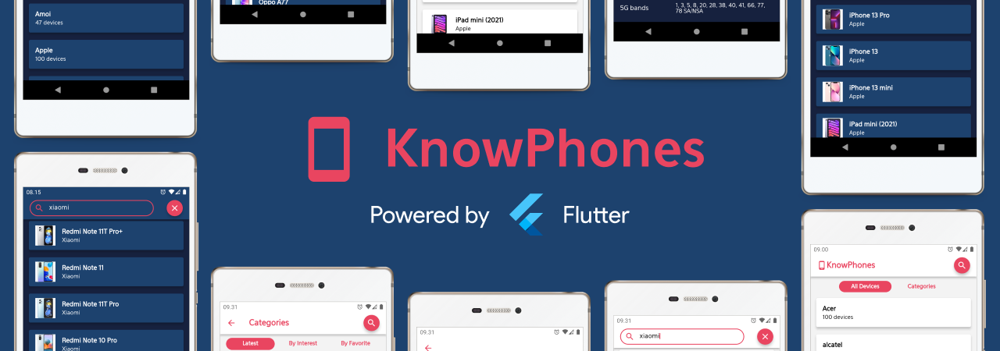
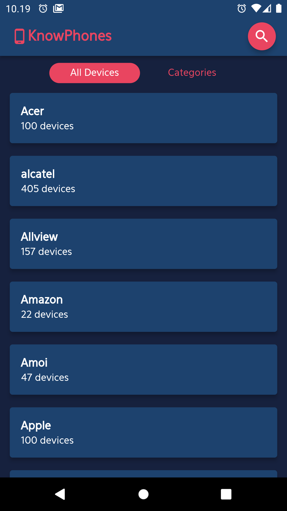
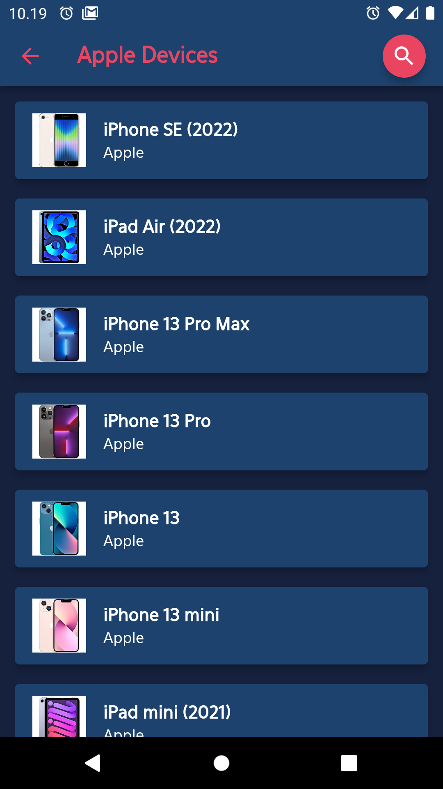
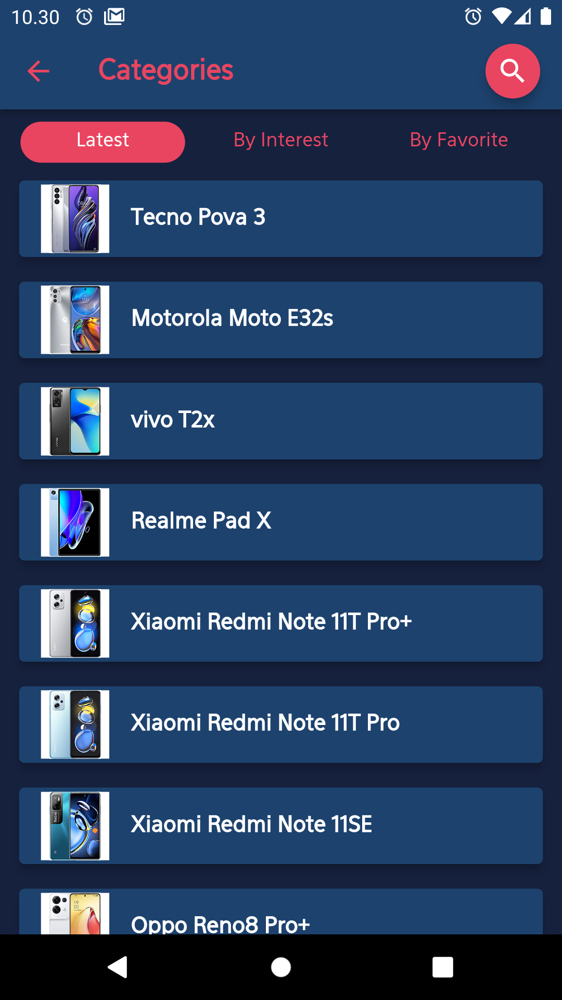
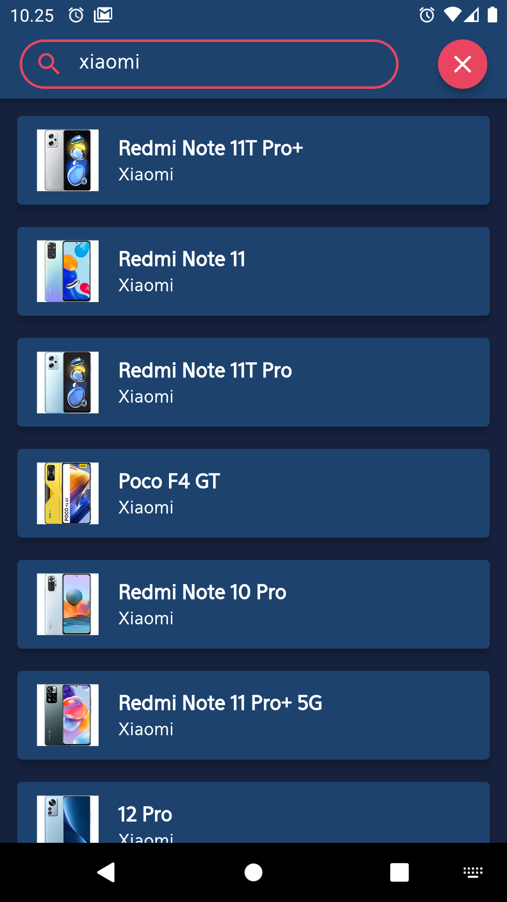

    

<strong>Know more about phones.</strong>

This Flutter app shows devices from [GSMArena](https://www.gsmarena.com/) through an [unofficial API](https://github.com/azharimm/phone-specs-api).

Features:
- List devices based on the brand
- List devices based on the latest, interest and favorite
- Search devices
- See the details of the device as well

	
    
	
	

